# 📚 AI 小说生成系统

> 基于 MySQL 外部记忆的智能小说创作平台，让 AI 真正记住剧情、角色和世界设定。

<p align="center">
  
  
  
  
  
</p>

---

## 🎯 项目简介

**AI 小说生成系统** 是一款专为长篇小说创作设计的智能辅助工具。它解决了传统 AI 写作中的核心痛点：

- ❌ **记忆丢失**：AI 忘记之前的剧情设定
- ❌ **角色混乱**：角色状态不一致，死人复活
- ❌ **设定冲突**：世界规则前后矛盾
- ❌ **无法追溯**：无法查看角色成长轨迹

✅ **我们的解决方案**：使用 MySQL 作为 AI 的"外部记忆"，结构化存储所有剧情、角色和世界设定，确保 AI 每次生成都能基于准确的历史状态。

---

## 🌟 核心功能

### 1. 🧠 MySQL 外部记忆系统

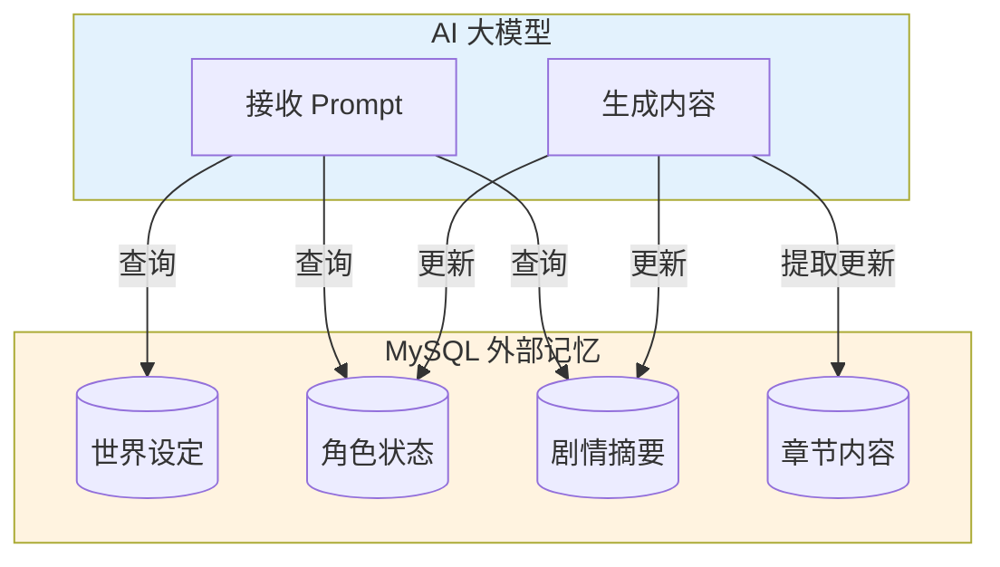

**特性**：
- 📝 结构化存储角色（姓名/等级/状态/属性）
- 🌍 世界设定持久化（规则/背景/境界体系）
- 📊 剧情摘要自动更新
- 🔄 角色状态变更追踪

### 2. 👤 智能角色管理

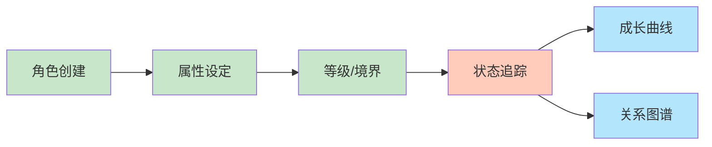

**特性**：
- 🎭 主角/配角分类管理
- 📈 成长曲线可视化
- 🔗 角色关系图谱
- ⚡ 实时状态同步

### 3. ⏱️ 时间线管理

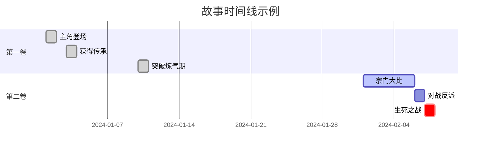

**特性**：
- 📅 日历/时间轴/列表三视图
- 🏷️ 事件分类（章节/战斗/突破/日常）
- 🔍 按角色筛选事件
- 💾 本地持久化存储

### 4. 📤 多格式导出

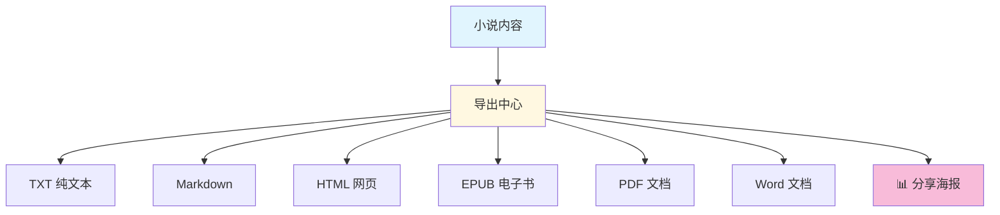

### 5. 📊 写作统计与分析

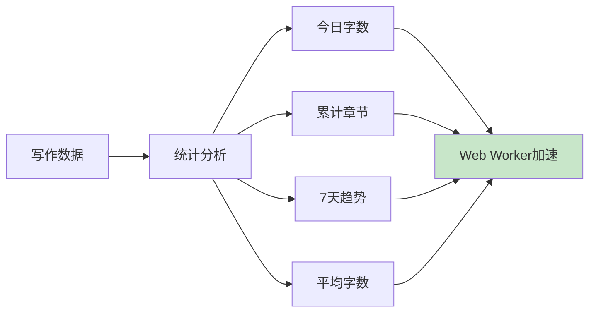

---

## 🏗️ 技术架构

### 系统架构图

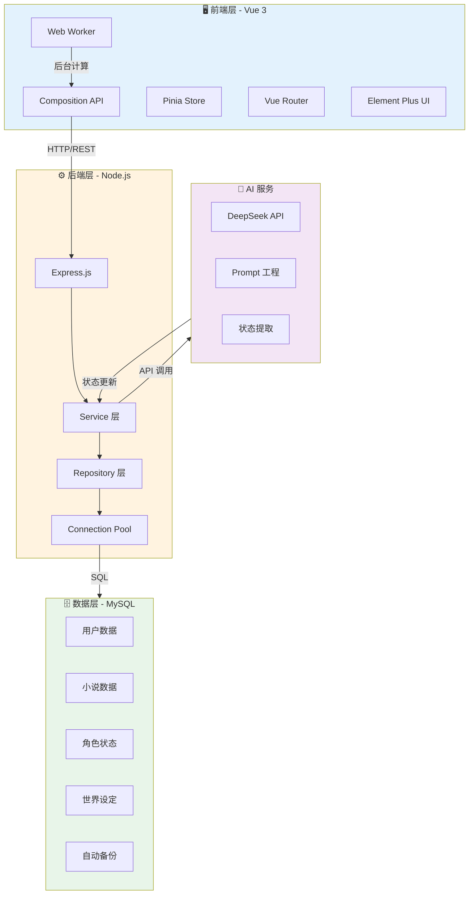

### 数据库架构

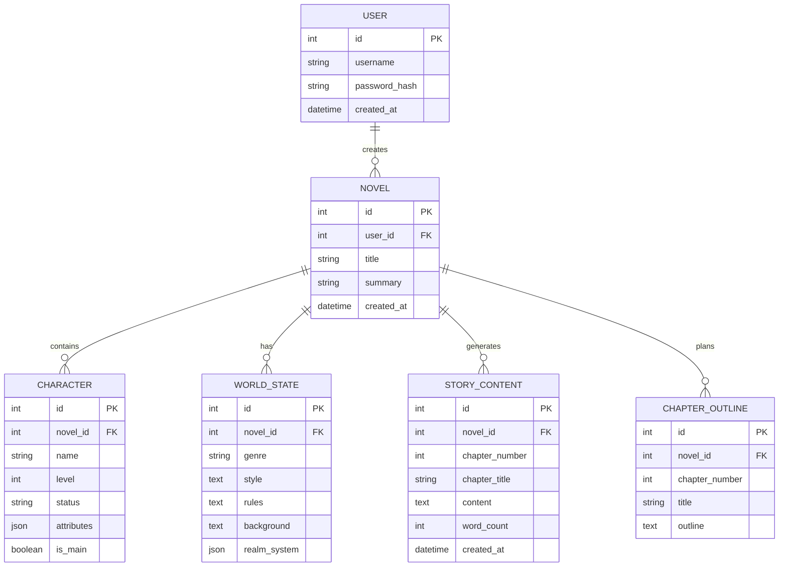

---

## 🚀 快速开始

### 环境要求

| 组件 | 版本 |
|------|------|
| Node.js | ≥ 18.0 |
| MySQL | ≥ 8.0 |
| npm | ≥ 9.0 |

### 1️⃣ 数据库初始化

```bash
# 登录 MySQL
mysql -u root -p

# 导入数据库结构
source database/schema.sql

# 或使用命令行
mysql -u root -p < database/schema.sql
```

### 2️⃣ 后端启动

```bash
cd backend

# 安装依赖
npm install

# 配置环境变量
cp .env.example .env
# 编辑 .env 填入你的 AI API Key

# 启动开发服务器
npm run dev
```

后端服务运行于 `http://localhost:8080`

### 3️⃣ 前端启动

```bash
cd frontend

# 安装依赖
npm install

# 启动开发服务器
npm run dev
```

前端服务运行于 `http://localhost:3000`

---

## ⚙️ 配置说明

### 后端配置 (backend/.env)

```env
# ============================================
# 数据库配置
# ============================================
DB_HOST=localhost
DB_PORT=3306
DB_USER=root
DB_PASSWORD=your_password
DB_NAME=ai_novel_db

# 连接池配置（已优化）
DB_POOL_LIMIT=20
DB_QUEUE_LIMIT=100

# ============================================
# AI 服务配置
# ============================================
AI_API_KEY=sk-your-api-key-here
AI_BASE_URL=https://api.deepseek.com/v1
AI_MODEL=deepseek-chat

# 其他支持的接口
# AI_BASE_URL=https://api.openai.com/v1
# AI_BASE_URL=https://api.siliconflow.cn/v1
```

---

## 📖 使用指南

### 创建小说

1. 点击 **"创建新小说"** 按钮
2. 输入小说标题
3. 进入小说详情页

### 设置世界观

```
编辑世界设定 → 填写以下信息：

📚 小说类型：玄幻/修仙/都市/历史...
✍️ 写作风格：语言风格、叙事节奏、情感基调
📜 世界规则：境界体系、力量规则、社会结构
🌍 世界背景：地理环境、历史事件、时代特征
```

### 添加角色

```
添加角色 → 填写信息：

👤 角色名：主角名称
📊 等级/境界：炼气期/金丹期/元婴期...
📋 属性：{"力量": 85, "智力": 90, "魅力": 78}
⭐ 主角标识：是否为主要角色
```

### 生成章节

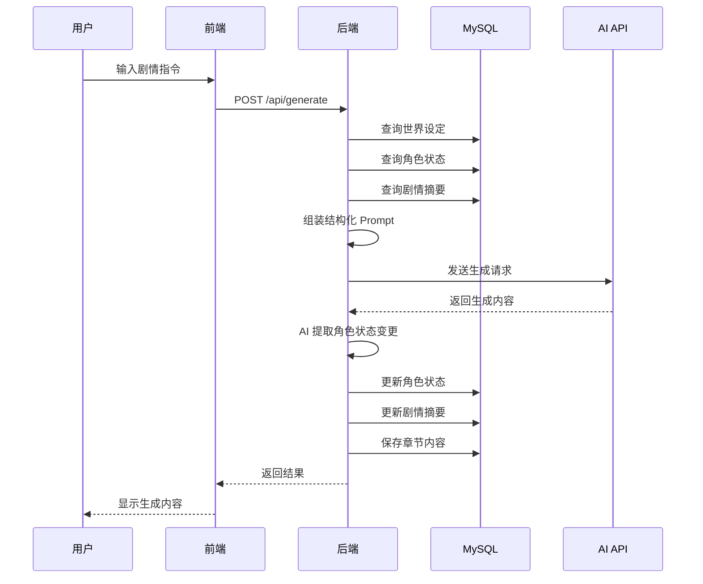

**示例指令**：
- "让主角在秘境中获得上古传承"
- "反派角色阴谋败露，被主角击败"
- "主角突破到元婴期，引发天地异象"

---

## 📁 项目结构

```
ai-novel-generator/
├── 📁 database/                  # 数据库文件
│   └── schema.sql               # 数据库结构定义
│
├── 📁 backend/                  # 后端服务
│   ├── src/
│   │   ├── 📁 config/           # 配置
│   │   │   └── database.js      # 连接池 + 备份机制
│   │   ├── 📁 controllers/      # 控制器
│   │   ├── 📁 services/         # 业务逻辑
│   │   ├── 📁 repositories/     # 数据访问层
│   │   ├── 📁 routes/           # 路由定义
│   │   ├── 📁 utils/            # 工具函数
│   │   └── index.js             # 入口文件
│   ├── .env                     # 环境配置
│   └── package.json
│
├── 📁 frontend/                 # 前端应用
│   ├── src/
│   │   ├── 📁 api/              # API 接口
│   │   ├── 📁 views/            # 页面组件
│   │   ├── 📁 components/       # 通用组件
│   │   ├── 📁 composables/      # Vue 组合式函数
│   │   ├── 📁 stores/           # Pinia 状态管理
│   │   ├── 📁 workers/          # Web Worker
│   │   └── main.js              # 入口文件
│   ├── package.json
│   └── vite.config.js
│
└── README.md
```

---

## 🔌 API 接口文档

### 小说管理

| 方法 | 路径 | 描述 |
|------|------|------|
| POST | `/api/novel/create` | 创建小说 |
| GET | `/api/novel/list` | 获取小说列表 |
| GET | `/api/novel/:id` | 获取小说详情 |
| DELETE | `/api/novel/:id` | 删除小说 |

### 角色管理

| 方法 | 路径 | 描述 |
|------|------|------|
| POST | `/api/character/add` | 添加角色 |
| GET | `/api/character/:novelId` | 获取角色列表 |
| PUT | `/api/character/:id` | 更新角色 |
| DELETE | `/api/character/:id` | 删除角色 |

### 世界设定

| 方法 | 路径 | 描述 |
|------|------|------|
| POST | `/api/world/update` | 更新世界设定 |
| GET | `/api/world/:novelId` | 获取世界设定 |

### 内容生成

| 方法 | 路径 | 描述 |
|------|------|------|
| POST | `/api/generate` | 生成小说内容 |
| POST | `/api/generate/outline` | AI 拆解大纲 |
| POST | `/api/generate/chapters` | 批量生成章节大纲 |

### 导出功能

| 方法 | 路径 | 描述 |
|------|------|------|
| GET | `/api/export/:novelId` | 导出小说内容 |

---

## 💡 核心优势对比

### vs 纯 Prompt 记忆

| 维度 | 纯 Prompt | MySQL 外部记忆 |
|------|-----------|---------------|
| 精确度 | ❌ 文本混合，容易遗漏 | ✅ 结构化查询，精确获取 |
| 可更新性 | ❌ 需要重写整个 Prompt | ✅ 单独 UPDATE 某字段 |
| 可追溯性 | ❌ 历史状态丢失 | ✅ 完整历史记录 |
| 查询能力 | ❌ 无法筛选统计 | ✅ SQL 灵活查询 |

### vs JSON 全量存储

| 维度 | JSON 全量 | 结构化 + JSON |
|------|-----------|--------------|
| 查询能力 | ❌ 无法 SQL 查询内部 | ✅ 核心字段可查询 |
| 扩展性 | ✅ 任意扩展 | ✅ 扩展字段 JSON |
| 规范性 | ❌ 无约束 | ✅ 符合数据库范式 |
| 性能 | ❌ 全量读写 | ✅ 增量更新 |

---

## 🛠️ 高级特性

### Web Worker 加速

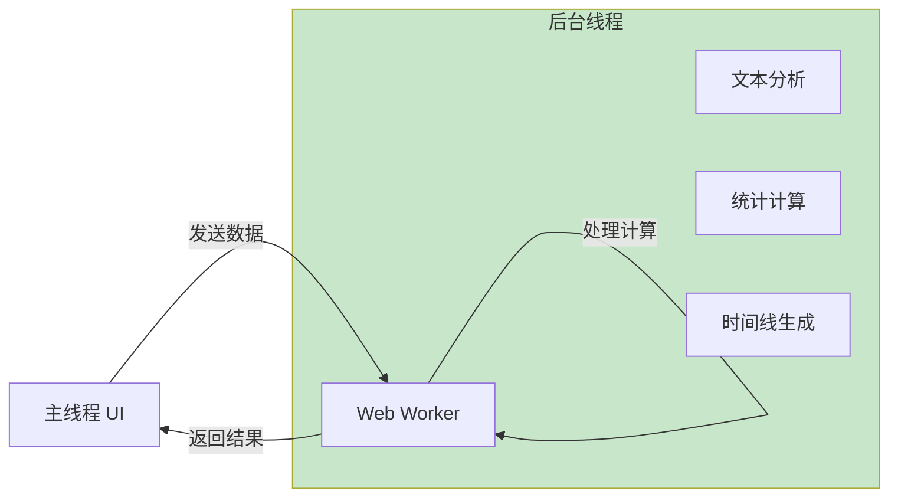

用于：
- 📊 大数据量统计计算
- 📝 文本分词分析
- ⏱️ 时间线数据生成

### 数据库连接池优化

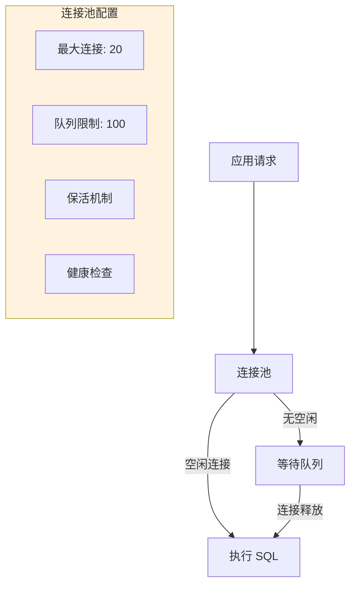

### 自动备份机制

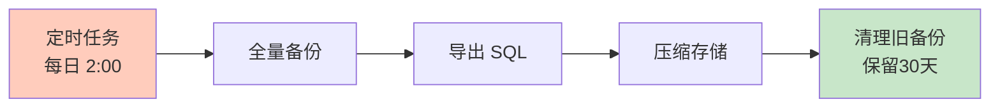

---

## 🔮 未来规划

- [ ] 多用户协作编辑
- [ ] AI 自动续写模式
- [ ] 语音输入生成
- [ ] 智能配图生成
- [ ] 移动端 App
- [ ] 发布到小说平台

---

## 🤝 贡献指南

欢迎提交 Issue 和 Pull Request！

```bash
#  Fork 项目
#  创建分支
git checkout -b feature/your-feature

#  提交更改
git commit -m "feat: add new feature"

#  推送分支
git push origin feature/your-feature

#  创建 Pull Request
```

---

## 📄 许可证

[MIT License](LICENSE) © 2024 AI Novel Generator

---

<p align="center">
  <b>🌟 如果这个项目对你有帮助，请给个 Star！</b>
</p>
